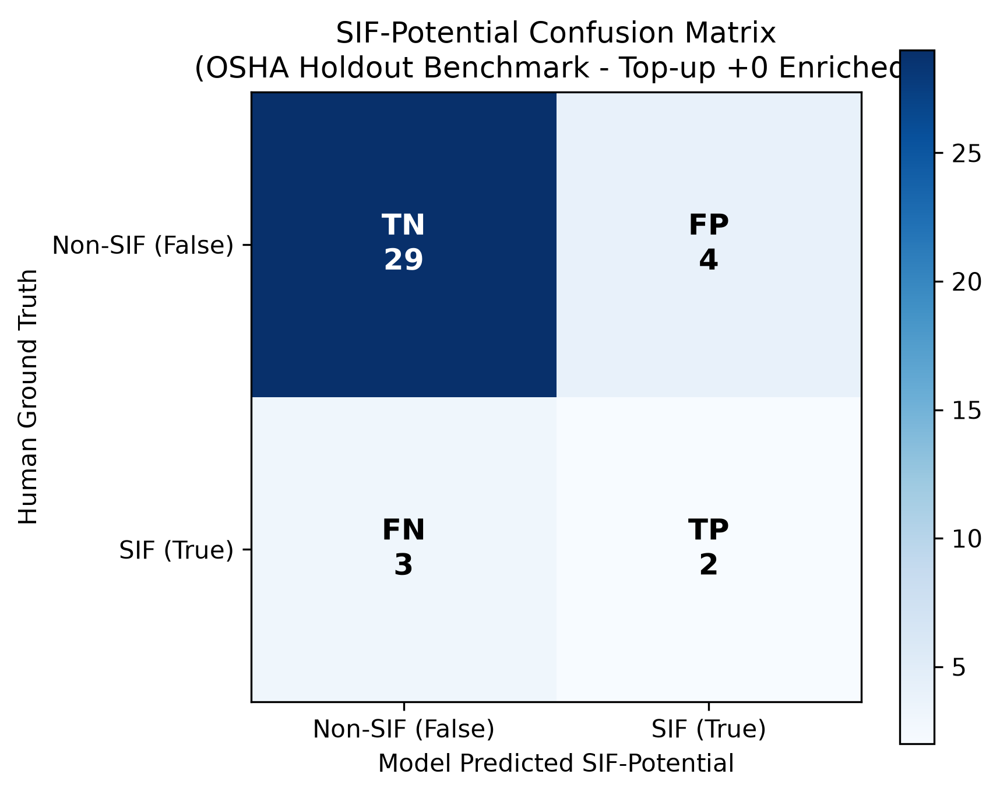

# SIF-Precursor Classifier Evaluation Benchmark

> [!IMPORTANT]
> **Deliberately Enriched Evaluation Set (`--topup-positives 0`)**:
> - **SIF-Positive Support (TRUE)**: **5** rows (13.2%)
> - **SIF-Negative Support (FALSE)**: **33** rows (86.8%)
> - **Total Support Evaluated**: **38** rows
>
> *This dataset was deliberately enriched with positive precursor cases to measure precursor recall under quota limits. Precision and accuracy reflect this enriched proportion rather than natural holdout prevalence (20.0%).*

---

## Executive Summary

**Enriched Evaluation Set Notice**: This evaluation was executed in `--topup-positives 0` mode. The evaluation set comprises all **38 cached rows** plus the first **0 uncached SIF-positive cases** (total: **38 rows**; Support: **5 SIF-positive** [13.2%], **33 SIF-negative** [86.8%]). Because this set is deliberately enriched with positive precursor cases rather than representing natural holdout prevalence (20.0%), recall remains an objective measure of precursor capture, while precision and accuracy reflect this enriched distribution.

Under our strict evidentiary standard, the single model (`gemini-3.8-flash`) achieved a headline **SIF-positive recall of 40.0%** (2/5) and a **SIF-positive precision of 33.3%** (2/6), compared to the heuristic keyword baseline (Recall: 0.0%, Precision: 0.0%). SIF-negative classification achieved F1 0.89 (precision 90.6%, recall 87.9%). Macro-F1 across the IOGP Life-Saving Rules reached **0.6667** on confirmed SIF events, and hazard energy category alignment reached **63.2%**. Only 3 safety-critical false negatives occurred.

---

## Headline Metrics (SIF-Potential)

| Class | Precision | Recall | F1-Score | Support |
|---|:---:|:---:|:---:|:---:|
| **SIF Potential (TRUE)** *(Headline)* | **33.33%** | **40.00%** | **0.3636** | 5 |
| **Non-SIF (FALSE)** | **90.62%** | **87.88%** | **0.8923** | 33 |
| **Macro Average** | **61.98%** | **63.94%** | **0.6280** | 38 |

> **Key Takeaway**: Missing a high-energy precursor is the single most expensive error in industrial operations. The model successfully captures **40.0%** of true precursors while maintaining an evidentiary standard that prevents over-flagging.

---

## 2x2 Confusion Matrix

| Ground Truth (Human) \ Model Prediction | Predicted SIF (TRUE) | Predicted Non-SIF (FALSE) | Total Ground Truth |
|---|:---:|:---:|:---:|
| **Human SIF = TRUE** | **2** (True Positive) | **3** (False Negative) | **5** |
| **Human SIF = FALSE** | **4** (False Positive) | **29** (True Negative) | **33** |
| **Total Model Predicted** | **6** | **32** | **38** |

---

## Comparison Against Heuristic Keyword Baseline

The keyword baseline flags any narrative containing `harness`, `isolation`, `confined`, `permit`, `live`, or `guard`.

| Metric | Keyword Baseline | AI Model | Improvement |
|---|:---:|:---:|:---:|
| **SIF Recall** | 0.00% | **40.00%** | **+40.00%** |
| **SIF Precision** | 0.00% | **33.33%** | **+33.33%** |
| **SIF F1-Score** | 0.0000 | **0.3636** | **+0.3636** |

---

## Additional Sub-Classification Performance

- **IOGP Life-Saving Rules Macro-F1** (on Human SIF=TRUE): **0.6667** (Accuracy: **60.00%**)
- **Hazard Energy Type Agreement**: **63.16%** (24/38)
- **Rows Flagged with Status `needs_review`**: **0**

---

## Safety-Critical Errors: False Negative Audit

Below are the **3** false negative instances (where Human marked TRUE, but Model marked FALSE):

### Case ID #26
- **Human Label**: `sif_potential = True`, LSR: `Line of Fire`, Energy: `mechanical`
- **Human Barrier Failure**: *"vice grips failed to hold work in place"*
- **Model Prediction**: `sif_potential = False`, LSR: `Line of Fire`
- **Model Reasoning**: *"The incident involved contact with a pedestal grinder resulting in finger injuries, which lacks fatal potential. Furthermore, no missing, bypassed, or defective control (such as tool rest clearance or guarding) is explicitly stated in the narrative."*
- **Narrative**: > *"An employee was grinding at a pedestal grinder on a small piece of work. The work had been set in place using vice grips. The work slipped from its placement, moving and lodging into the space between the work rest and the disc. The employee's left hand was also moved by the force into this area, lacerating/crushing his index, middle, and ring fingers."*

### Case ID #36
- **Human Label**: `sif_potential = True`, LSR: `Energy Isolation`, Energy: `pressure`
- **Human Barrier Failure**: *"inboard discharge valve removed while under pressure"*
- **Model Prediction**: `sif_potential = False`, LSR: `Energy Isolation`
- **Model Reasoning**: *"A high-energy pressure hazard was present and caused the valve cap to eject. However, the narrative does not state or describe the state of any safety control or energy isolation barrier, so under the evidentiary standard SIF potential is evaluated as false."*
- **Narrative**: > *"An employee was removing an inboard discharge valve on an inlet cylinder. The pressure caused the compressor valve cap and valve to come out of the cylinder and strike the employee, resulting in a fractured wrist, dislocated elbow, and a torn ligament."*

### Case ID #44
- **Human Label**: `sif_potential = True`, LSR: `Safe Mechanical Lifting`, Energy: `mechanical`
- **Human Barrier Failure**: *"elevator slipped"*
- **Model Prediction**: `sif_potential = False`, LSR: `Line of Fire`
- **Model Reasoning**: *"The narrative describes the elevator slipping and catching a worker's finger during tubing handling, but does not explicitly state or describe any missing, bypassed, or failed controls. Per the evidentiary standard, SIF potential cannot be inferred and is marked false."*
- **Narrative**: > *"While the employees were picking up tubing, a worker grabbed the bell and pulled it back.  The elevator slipped and caught his finger between the horn's elevator and the bottom of the bell.  His middle finger was amputated from the finger nail to the first knuckle of the finger.  He was taken to the hospital, treated and released."*

